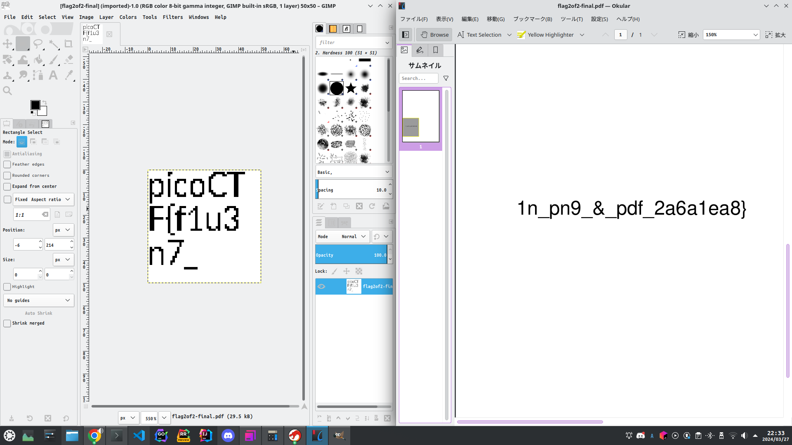
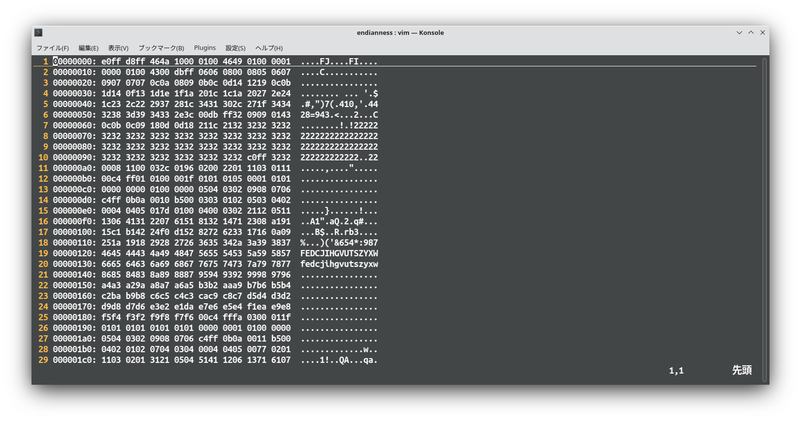
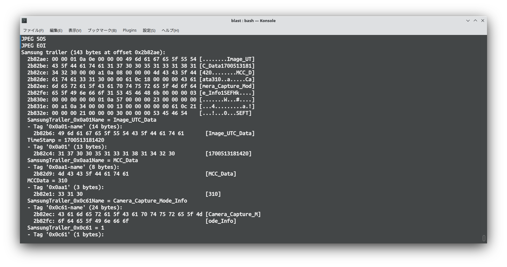

# Forensics

## Scan Surprise
It just QRCode.<br />
Scan it with any scanner.<br />

## Verify
Find the file that has the Description's sha256sum.
```Bash
find ./ -type f -exec sha256sum {} + | grep b09c99c555e2b39a7e97849181e8996bc6a62501f0149c32447d8e65e205d6d2
b09c99c555e2b39a7e97849181e8996bc6a62501f0149c32447d8e65e205d6d2  ./451fd69b
```
Then run decrypt.sh, but I have to change the path of file directory.<br />

```Bash
$ ./decrypt.sh ./files/451fd69b
picoCTF{trust_but_verify_451fd69b}
```

## CanYouSee
Download file and check exif.<br />
There is Interesting value in 'Attribution URL'.<br />
```Bash
$ exiftool ukn_reality.jpg 
ExifTool Version Number         : 12.40
File Name                       : ukn_reality.jpg
Directory                       : .
File Size                       : 2.2 MiB
File Modification Date/Time     : 2024:03:12 09:05:57+09:00
File Access Date/Time           : 2024:03:19 15:32:45+09:00
File Inode Change Date/Time     : 2024:03:13 16:09:01+09:00
File Permissions                : -rw-r--r--
File Type                       : JPEG
File Type Extension             : jpg
MIME Type                       : image/jpeg
JFIF Version                    : 1.01
Resolution Unit                 : inches
X Resolution                    : 72
Y Resolution                    : 72
XMP Toolkit                     : Image::ExifTool 11.88
Attribution URL                 : cGljb0NURntNRTc0RDQ3QV9ISUREM05fZDhjMzgxZmR9Cg==
Image Width                     : 4308
Image Height                    : 2875
Encoding Process                : Baseline DCT, Huffman coding
Bits Per Sample                 : 8
Color Components                : 3
Y Cb Cr Sub Sampling            : YCbCr4:2:0 (2 2)
Image Size                      : 4308x2875
Megapixels                      : 12.4

$ base64 -d
cGljb0NURntNRTc0RDQ3QV9ISUREM05fZDhjMzgxZmR9Cg== 
picoCTF{ME74D47A_HIDD3N_d8c381fd}
```

## Secret of the Polyglot
Open the file in Okular and I found a part of flag.<br />
It contains 'pn9' so I open the file in GIMP too.<br />



## Mob psycho
It's an apk file.<br />
The Hint said Apk file could unzip.<br />
So I tried to unzip and find the flag.txt.<br />
```Bash
$ find . -name "flag.txt"
./unziper/res/color/flag.txt

$ cat unziper/res/color/flag.txt 
7069636f4354467b6178386d433052553676655f4e5838356c346178386d436c5f37303364643965667d

$ unhex 7069636f4354467b6178386d433052553676655f4e5838356c346178386d436c5f37303364643965667d
picoCTF{ax8mC0RU6ve_NX85l4ax8mCl_703dd9ef}
```

## endianness-v2
Open with binary editor.<br />



I observed the header of file.<br />
```Bash
e0ff d8ff
```
I notice that it is reversed from JPEG header.<br />
```Python
def convert_bytes(file_path):
    with open(file_path, 'rb') as file:
        data = file.read()

    converted_data = bytearray()

    for i in range(0, len(data), 4):
        chunk = data[i:i+4]
        for j in range(0, len(chunk), 2):
            byte_pair = chunk[j:j+2]
            byte_pair_reversed = byte_pair[::-1]
            if j == 0:
                tmpData = byte_pair_reversed
            else:
                converted_data.extend(byte_pair_reversed)
                converted_data.extend(tmpData)

    return bytes(converted_data)
file_path = 'challengefile'
converted_data = convert_bytes(file_path)

with open("out","wb") as f:
    f.write(converted_data)
```
## Blast from the past
Change exif with exiftool.<br />
```Bash
exiftool -overwrite_original "-SubSecTimeOriginal=001" modi.jpg 
exiftool -overwrite_original "-SubSecTimeDigitized=001" modi.jpg 
exiftool -overwrite_original "-SubSecTime=001" modi.jpg 
exiftool -overwrite_original "-alldates=1970:01:01 00:00:00" modi.jpg
```
Last check is exif of Samsung.<br />
[Samsung Tags](https://exiftool.org/TagNames/Samsung.html)<br />
The value of Samsung:Time Stamp is not writable.<br />
So I have to change it value in binary editor.<br />
'exiftool -v3' option is useful to specify address of exif data.<br />




## Dear Diary

Using autopsy and search '.txt'.<br />


There are parts of flag.<br />