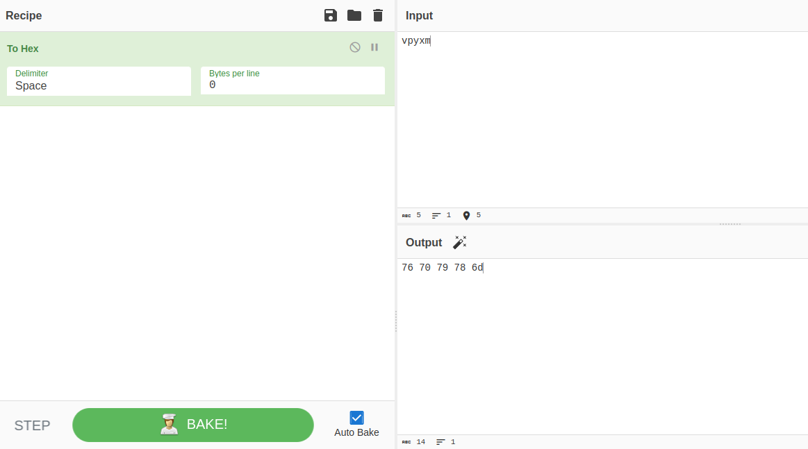

# General Skills

## Super SSH

Just ssh
```Bash
~$ ssh -p 49226 ctf-player@titan.picoctf.net
ctf-player@titan.picoctf.net's password:
Welcome ctf-player, here's your flag: picoCTF{s3cur3_c0nn3ct10n_65a7a106}
Connection to titan.picoctf.net closed.
```
## Commitment Issues

Check Git Log
```Bash
drop-in$ git log -p
commit 144fdc44b09058d7ea7f224121dfa5babadddbb9 (HEAD -> master)
Author: picoCTF <ops@picoctf.com>
Date:   Tue Mar 12 00:06:25 2024 +0000

    remove sensitive info

diff --git a/message.txt b/message.txt
index 3a71673..d552d1e 100644
--- a/message.txt
+++ b/message.txt
@@ -1 +1 @@
-picoCTF{s@n1t1z3_be3dd3da}
+TOP SECRET

commit 7d3aa557ff7ba7d116badaf5307761efb3622249
Author: picoCTF <ops@picoctf.com>
Date:   Tue Mar 12 00:06:25 2024 +0000

    create flag

diff --git a/message.txt b/message.txt
new file mode 100644
index 0000000..3a71673
--- /dev/null
+++ b/message.txt
@@ -0,0 +1 @@
+picoCTF{s@n1t1z3_be3dd3da}
```
## Time Machine

Check Git Log
```Bash
drop-in$ git log -p
commit e65fedb3a72a16c577f4b17023b63997134b307d (HEAD -> master)
Author: picoCTF <ops@picoctf.com>
Date:   Tue Mar 12 00:07:29 2024 +0000

    picoCTF{t1m3m@ch1n3_88c35e3b}

diff --git a/message.txt b/message.txt
new file mode 100644
index 0000000..4324621
--- /dev/null
+++ b/message.txt
@@ -0,0 +1 @@
+This is what I was working on, but I'd need to look at my commit history to know why...
\ No newline at end of file
```
## Blame Game

Check Git Log within message.py
```Bash
drop-in$ git log -- message.py
commit 23e9d4ce78b3cea725992a0ce6f5eea0bf0bcdd4
Author: picoCTF{@sk_th3_1nt3rn_81e716ff} <ops@picoctf.com>
Date:   Tue Mar 12 00:07:15 2024 +0000

    optimize file size of prod code

commit 3ce5c692e2f9682a866c59ac1aeae38d35d19771
Author: picoCTF <ops@picoctf.com>
Date:   Tue Mar 12 00:07:15 2024 +0000

    create top secret project
```

## Collaborative Development

Check git branch
```Bash
drop-in$ git branch -a
  feature/part-1
  feature/part-2
  feature/part-3
* main
```
Check flag.py each branch
```Python
# feature/part-1
print("Printing the flag...")
print("picoCTF{t3@mw0rk_", end='')

# feature/part-2
print("Printing the flag...")

print("m@k3s_th3_dr3@m_", end='')
# feature/part-3
cat flag.py 
print("Printing the flag...")

print("w0rk_798f9981}")

# result
print("picoCTF{t3@mw0rk_", end='')
print("m@k3s_th3_dr3@m_", end='')
print("w0rk_798f9981}")
```
## binhexa
Operate 2 value in<br />
```Bash
*   :Multiplication
<<  :Left Bit Shift
&   :And
>>  :Right Bit Shift
|   :Or
+   :Add
```
I used KCalc (KDE Calculator) for operation.

## Binary Search
Binary Search Between 1 ~ 1000
```Bash
$ ssh -p 64963 ctf-player@atlas.picoctf.net 
Welcome to the Binary Search Game!
I'm thinking of a number between 1 and 1000.
Enter your guess: 500
Higher! Try again.
Enter your guess: 750
Higher! Try again.
Enter your guess: 875
Higher! Try again.
Enter your guess: 938
Higher! Try again.
Enter your guess: 969
Lower! Try again.
Enter your guess: 953
Lower! Try again.
Enter your guess: 945
Higher! Try again.
Enter your guess: 949
Higher! Try again.
Enter your guess: 951
Congratulations! You guessed the correct number: 951
Here's your flag: picoCTF{g00d_gu355_bee04a2a}
Connection to atlas.picoctf.net closed.
```
## endianness
Using 
[Cyber Chef](https://cyberchef.org/#recipe=To_Hex('Space',0))
to convert word into hex.<br />
Cyber Chef could swap endianness.



```Bash
tsuneki:~/dc/ctf/pico2024/general/collabo/drop-in$ nc titan.picoctf.net 56286
Welcome to the Endian CTF!
You need to find both the little endian and big endian representations of a word.
If you get both correct, you will receive the flag.
Word: vpyxm
Enter the Little Endian representation: 6d78797076        
Correct Little Endian representation!
Enter the Big Endian representation: 767079786d
Correct Big Endian representation!
Congratulations! You found both endian representations correctly!
Your Flag is: picoCTF{3ndi4n_sw4p_su33ess_cfe38ef0}
```

## dont-you-love-banners
Description said
>The server has been leaking some crucial information on tethys.picoctf.net 63705

I tried to prove this server in many way, but finally it just need to connect with nc.
```Bash
$ nc tethys.picoctf.net 63705
SSH-2.0-OpenSSH_7.6p1 My_Passw@rd_@1234
```
It looks like password.<br />
Then,Connect to the second server and answer some question.<br />
```Bash
$ nc tethys.picoctf.net 58650
*************************************
**************WELCOME****************
*************************************

what is the password? 
My_Passw@rd_@1234
What is the top cyber security conference in the world?
DEF CON
the first hacker ever was known for phreaking(making free phone calls), who was it?
Draper
player@challenge:~$
```
I got the shell and found script.py in root directory after digging.
```Python
# Part of script.py
    try:
      with open("/home/player/banner", "r") as f:
        print(f.read())
    except:
      print("*********************************************")
      print("***************DEFAULT BANNER****************")
      print("*Please supply banner in /home/player/banner*")
      print("*********************************************")
```
File /home/player/banner exists in home directory and I can edit it.<br />
There's also flag.txt in /root/ .<br />
Delete /home/player/banner and create symlink pointing to '/root/flag.txt'.
```Bash
player@challenge:~$ rm banner
player@challenge:~$ ln -s /root/flag.txt banner
player@challenge:~$ ls
banner  text

# Reconnect
$ nc tethys.picoctf.net 58650
picoCTF{b4nn3r_gr4bb1n9_su((3sfu11y_a0e119d4}

what is the password?
```
## SansAlpha
In this challenge, I have to read flag.txt without using alphabet.<br />
But we could use wild card.
So we could find the file like './*' and call '/bin/base64' like '/???/????64'<br />
But '/???/????64' also point '/bin/x86_64' so we have to run /???/????64[0]<br />

```Bash
SansAlpha$ ./*
bash: ./blargh: Is a directory

SansAlpha$ ./*/*
bash: ./blargh/flag.txt: Permission denied

SansAlpha$ _1=(/???/????64)
SansAlpha$ ${_1[0]} ./??????/????.???
cmV0dXJuIDAgcGljb0NURns3aDE1X211MTcxdjNyNTNfMTVfbTRkbjM1NV84YjNkODNhZH0=

# In my shell
$ base64 -d
cmV0dXJuIDAgcGljb0NURns3aDE1X211MTcxdjNyNTNfMTVfbTRkbjM1NV84YjNkODNhZH0=
return 0 picoCTF{7h15_mu171v3r53_15_m4dn355_8b3d83ad}
```