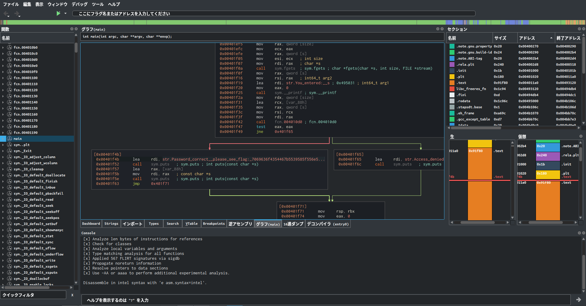
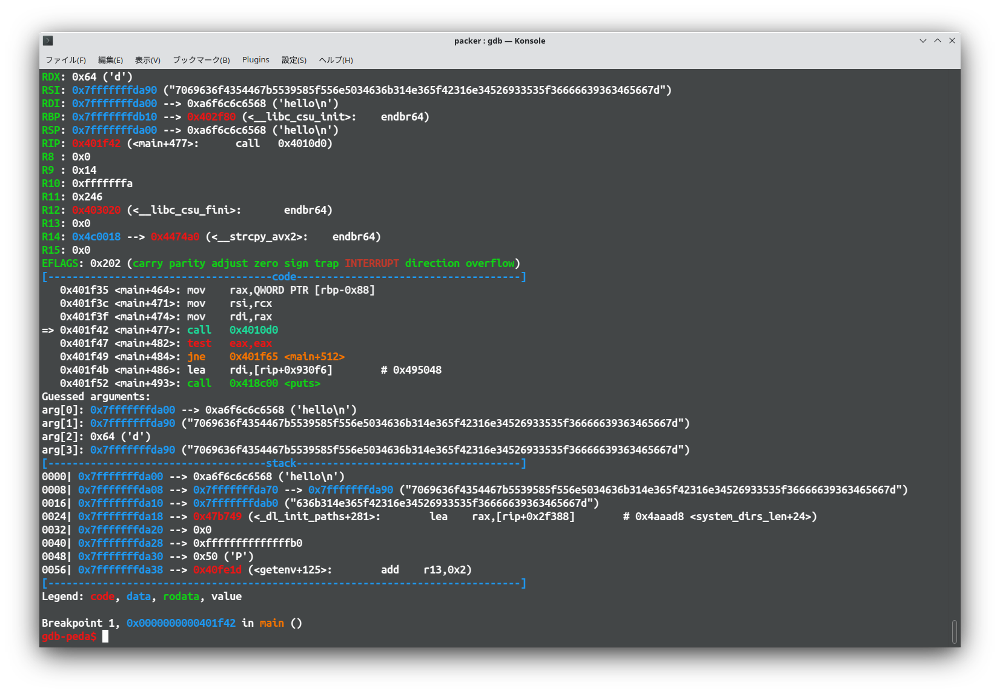
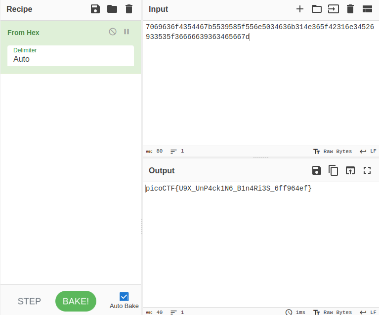
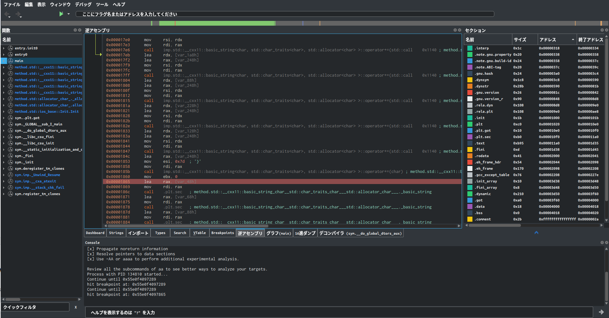
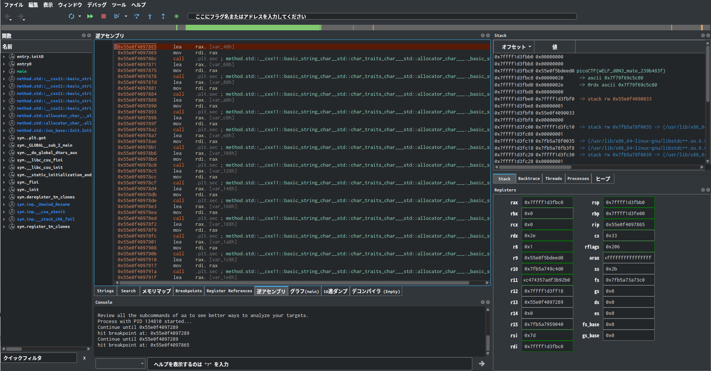
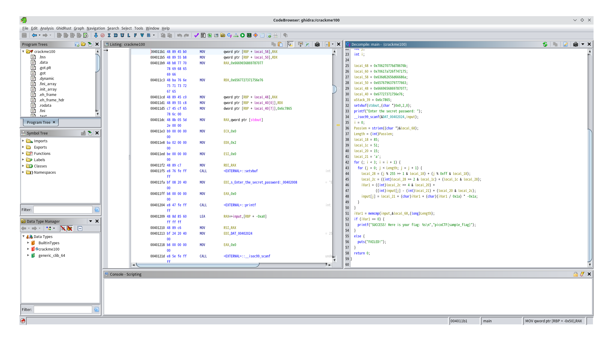
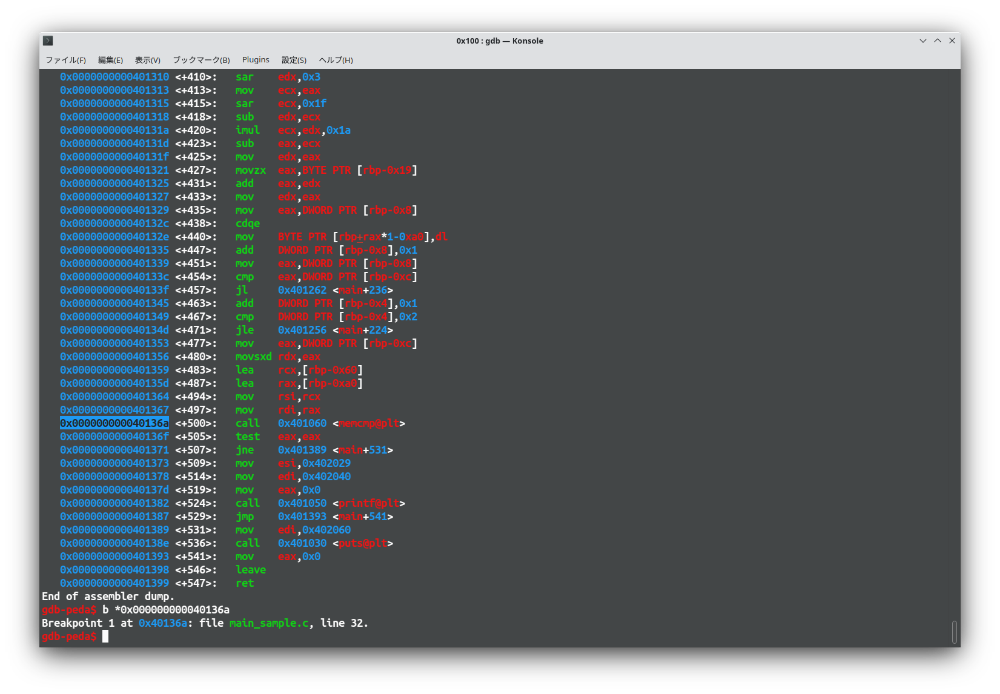
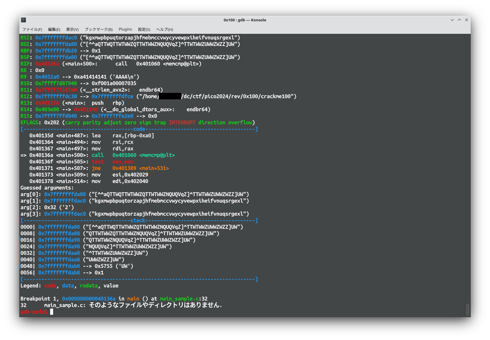

# Reverse Engineering

## packer
This Challenge Elf is reduced the size of a binary.<br />
Reverse it with 'upx -d'
```Bash
$ upx -d out
```

Check assembly.<br />
I often use Cutter when I want to check assembly.<br />



Then set the breakpoint at before call comp function : 0x4010d0 <br />
Run with gdb and check the value of RSI Register.<br />



It's a flag in hex.



## FactCheck
This Challenge Elf looks operate strings.<br />
It's tiresome to analyze flow of that so set the breakpoint after operate strings.<br />



Debug it with Cutter.<br />



I got the flag in the stack.<br />

## Classic CrackMe 0x100
It's simple auth program.<br />
Decompile it by Ghidra and check main function.<br />



It's make encrypt for my input.<br />
First check the correct encrypted value.<br />
Check the assembly and set breakpoint before memcpy.<br />



Then run and check RSI register.<br />



Now I have all the value I need to break the encryption.<br />
It's not demanding computation, so I solve it by brute force.<br />
```C
#include<stdio.h>
#include<string.h>
#include<stdlib.h>
int main(void){
    char pass[] = "kgxmwpbpuqtorzapjhfmebmccvwycyvewpxiheifvnuqsrgexl";
    size_t Passlen = strlen(pass);
    int Length = (int)Passlen;
    int local_18 = 85;
    int local_1c = 51;
    int local_20 = 15;
    char local_21 = 'a';
    for (int j = 0; j < Length; j = j + 1) {
        for(int f = 20;f < 127;f++){
            int tmp = f;
            for (int i = 0; i < 3; i = i + 1) {
                int local_28 = (j % 255 >> 1 & local_18) + (j % 255 & local_18);
                int local_2c = ((int)local_28 >> 2 & local_1c) + (local_1c & local_28);
                int iVar1 = ((int)local_2c >> 4 & local_20) + (tmp - (int)local_21) + (local_20 & local_2c);
                tmp = local_21 + (char)iVar1 + (char)(iVar1 / 0x1a) * -0x1a;   
                
                
            }
            if (tmp == pass[j]){
                    pass[j] = f;
                    break;
            }
        }
    }

    printf("%s\n",pass);
    return 0;
}
```

```Bash
$ gcc exploit.c 
$ ./a.out 
kdugtj(grknflq$dgb`d+%d#)mnm&mj"tjr`b(`&pelejf'"rc
$ ./crackme100 
Enter the secret password: kdugtj(grknflq$dgb`d+%d#)mnm&mj"tjr`b(`&pelejf'"rc
SUCCESS! Here is your flag: picoCTF{sample_flag}
```

## WinAntiDebug 0x100

## WinAntiDebug 0x200